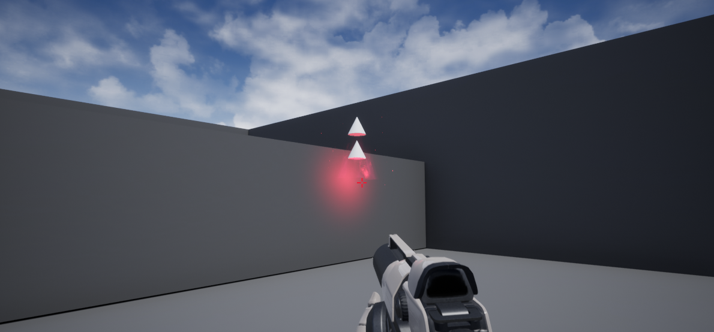

<b>RPG FPS</b>

Work in progress.
This is a Unreal Engine 4 and C++ project where I recreate existing systems from other RPG/FPS games, or just new abilities.
All code use the coding standards defined in https://docs.unrealengine.com/en-US/Programming/Development/CodingStandard/index.html.

Currently implemented:
- Blink ability from Dishonored (full C++)

